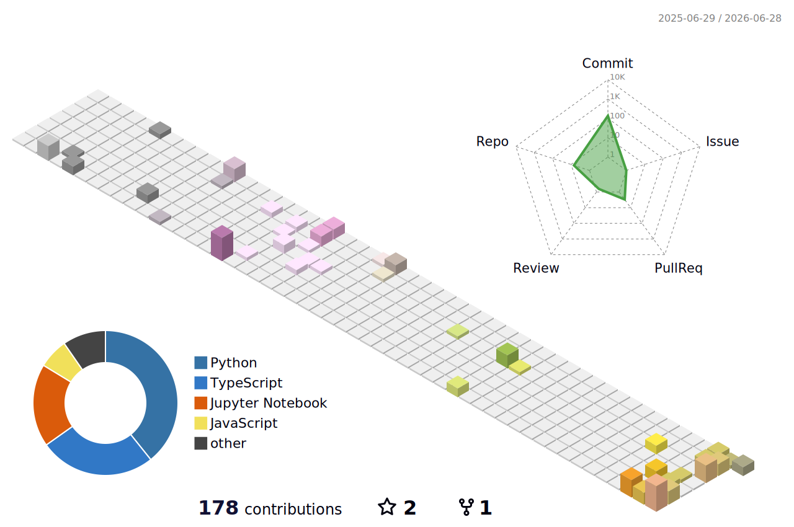

<p align="center">
  
</p>

<p align="center">
  
</p>

<p align="center">
  <a href="https://www.linkedin.com/in/rohit-panda/">
    
  </a>
  <a href="https://github.com/Roh00t">
    
  </a>
  <a href="mailto:pandarohit05@gmail.com">
    
  </a>
</p>

<p align="center">
  
  &nbsp;
  
  &nbsp;
  
  &nbsp;
  
</p>

---

## `$ whoami`

```
Location  : Singapore
Current   : Singtel SOC (Security Analyst, contract ended June 2026)
Next      : Synapxe!!! HOPEFULLY 🙏
Building  : ImplAI
Shipped   : ClauseGuard | Gavin-AI | PES | EDDA (hackathon)
Background: SPF Trainer (Jurong Div) | IBM | Accenture | MHA Innovation Award (SETS)
Interests : Security × AI intersection | Healthcare tech | CTF | Running
```

---

## 🛠️ Tech Stack

**Languages & Frameworks**

<p align="center">
  
</p>

**Security Operations**

<p align="center">
  
  
  
  
  
  
  
  
</p>

---

## 🚀 Projects

| | Project | Description | Stack | Status |
|--|---------|-------------|-------|--------|
| 🤖 | **[Gavin-AI](https://roh00t.github.io/Gavin-AI/)** | Self-hosted multi-tenant AI agent workspace — run isolated agent environments with profiles, tools, and channels per tenant | Python, AI Agents, Multi-tenant | ✅ Live |
| 📜 | **[ClauseGuard](https://clausegaurd-hm9g.onrender.com/)** | AI employment contract analyser — clause-level risk scoring on Singapore employment contracts, built at AIForge SMU 2026 | FastAPI, Supabase, TokenRouter | ✅ Live |
| 💪 | **[PES](https://roh00t.github.io/PES/)** | Portable IPPT trainer using MediaPipe computer vision — spiritual successor to SETS, fully client-side with no data leaving device | MediaPipe, JS, Web APIs | ✅ Live |
| 🏗️ | **[ImplAI](#)** | AI agent automation startup — WhatsApp lead qualification, workflow automation, and staff training for SMEs | Python, LLMs, ManyChat | 🚀 Building |
| 🕵️ | **[EDDA](https://github.com/Roh00t/EDDA)** | Employer due-diligence agent for job seekers — surfaces company red flags before you sign an offer (SupCareers × OpenAI Hackathon 2026) | AI Agents, Python | 🏆 Hackathon |
| 🚨 | **[myResponder+](https://github.com/NTUSIM/DELLSCDFInnovationChallenge2025)** | Advanced Community Role Allocation Engine (DELL × SCDF Hackathon 2025) | AI Agents, Python | 🏆 Hackathon |
| 🛡️ | **[Project Sentinel](https://frontend-production-32cc.up.railway.app/)** | Web-based IDS dashboard — aggregates and classifies raw logs from 3 intrusion detection systems | React, Node, Railway | ✅ Live |
| ⚠️ | **[Project Safety](https://safeops.figma.site)** | Risk Assessment Management prototype — RAW creation, certification tracking | Figma | ✅ Live |
| 🔒 | **[PassMan](https://github.com/Roh00t/PersonalProjects/tree/main/Passman)** | AES-encrypted password manager with support for 10,000+ entries | Python | ✅ Built |
| 🦠 | **[Malware Detection AI](https://github.com/Roh00t/PersonalProjects/tree/main/Malware_Detection_With_AI)** | Binary malware classification pipeline — Random Forest + XGBoost on PE file features | scikit-learn, XGBoost | ✅ Built |
| 🎵 | **[SpotifySecurityExt](https://github.com/Roh00t/PersonalProjects/tree/main/SpotifySecurityExt)** | Scans Spotify ad URLs via VirusTotal API — React frontend with threat result display | React, VirusTotal API | ✅ Built |
| 🧠 | **[AI IDS](https://github.com/Roh00t/PersonalProjects/tree/main/AI_IDS_Project)** | Supervised ML IDS using Scapy — real-time packet classification for threat detection | Scapy, scikit-learn | ✅ Built |

---

## 💼 Experience

**🔵 Singtel — Security Analyst** `Sept 2025 – June 2026`  
Monitoring and triage using Microsoft Sentinel, ArcSight ESM, Trellix EDR. Akamai WAF maintenance for enterprise clients. Co-managed DDoS scrubbing via Singtel MTR model. Management of Web Orion for WDMS.

**⚕️ Accenture — Quality Engineer** `Jun 2025 – Jul 2025`  
Validated National Billing System (NBS) rollout across 20+ Singapore healthcare clusters.

**🏥 IBM — Desktop Engineer** `Feb 2022 – Jul 2022`  
Led 10-person team deploying NGEMR and Electronic Collection Modules for hospitals in collaboration with Synapxe.

**🚔 Singapore Police Force — Trainer, Jurong Division** `Jul 2022 – May 2024`  
Help build SETS (Static Exercise Training System) using Python + computer vision → **MHA Innovation Award**. Developed RPA automation reducing repetitive workloads by ~60%. Commissioner's Award recipient.

---

## 📊 GitHub Stats

<p align="center">
  
  &nbsp;
  
</p>

<p align="center">
  
</p>

<p align="center">
  
</p>

<p align="center">
  
</p>

---

## 🏁 Hackathons & CTF

<details>
<summary><b>Expand full list</b></summary>

**Hackathons — All as Team Lead**
| Year | Event | Project |
|------|-------|---------|
| 2026 | SupCareers × OpenAI Hackathon | Gavin-AI · EDDA |
| 2026 | AIForge Hackathon SMU | ClauseGuard |
| 2025 | SGHackitRx Hackathon | — |
| 2025 | DELL SCDF Innovation Challenge | myResponder+ : Advanced Community Role Allocation Engine |
| 2025 | SIMGE Microsoft Hackathon | — |
| 2025 | Project Altair Hackathon | — |

**CTF Events**
| Event | Year | Format |
|-------|------|--------|
| Fortinet Blue Team CTF | 2025 | Team |
| Kaspersky CTF | 2025 | Team Lead |
| SSMCTF | 2025 | Team Lead |
| Blahaj CTF | 2024, 2025 | Solo |
| LearnCTF | — | Solo |

</details>

---

## 📅 Contribution Calendar

<p align="center">
  
</p>

---

## 🐍 Contribution Snake

<picture>
  <source media="(prefers-color-scheme: dark)" srcset="https://raw.githubusercontent.com/Roh00t/Roh00t/output/github-snake-dark.svg">
  <source media="(prefers-color-scheme: light)" srcset="https://raw.githubusercontent.com/Roh00t/Roh00t/output/github-snake.svg">
  
</picture>

---

<p align="center">
  
</p>

